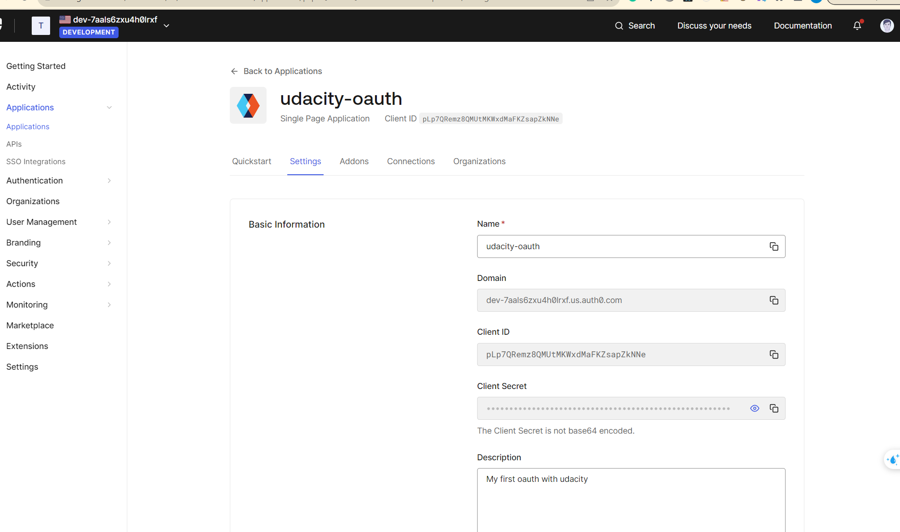
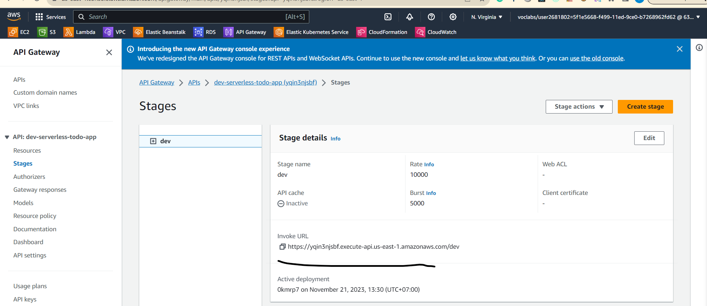
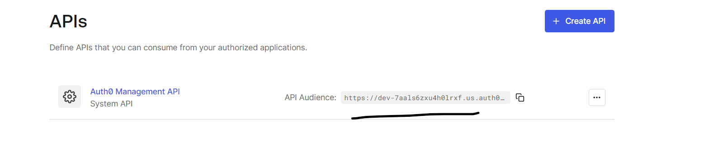
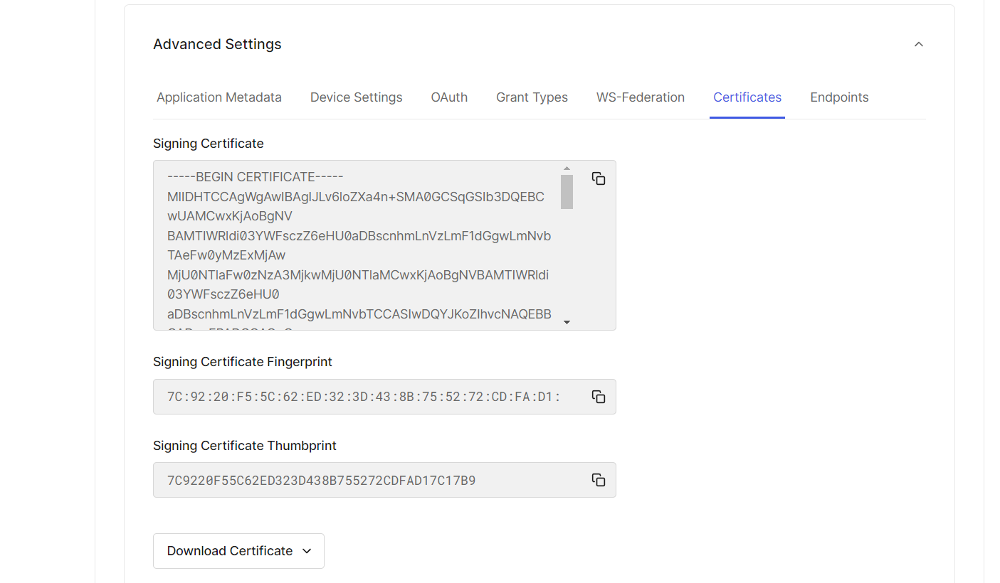
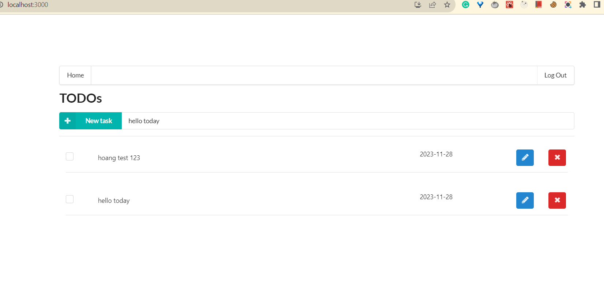

# Udacity Project 4: Serverless TODO APP

## 1. Client
```console
cd client
npm install
npm audit fix
```
Update Client Env in the **./client/.env** file as below:
```sh
REACT_APP_AUTH0_DOMAIN=dev-7aals6zxu4h0lrxf.us.auth0.com
REACT_APP_AUTH0_CLIENT_ID=pLp7QRemz8QMUtMKWxdMaFKZsapZkNNe
REACT_APP_API_ENDPOINT= https://yqin3njsbf.execute-api.us-east-1.amazonaws.com/dev
```

REACT_APP_AUTH0_DOMAIN
 

REACT_APP_API_ENDPOINT
 

Audience

## 2. Server
```console
cd server
npm install
npm audit fix
```
Update CERTIFICATE in **./server/src/lambda/auth/auth0Authorizer**
Get CERTIFICATE:

## 3. Deployment
 ```console
# For the first time, create an application in your org in Serverless portal
serverless
# Next time, deploy the app and note the endpoint url in the end
serverless deploy --verbose
# If you face a permissions error, you may need to specify the user profile
sls deploy -v --aws-profile serverless
# sls is shorthand for serverless
# -v is shorthand for --verbose
```
## 4. Homepage
 
