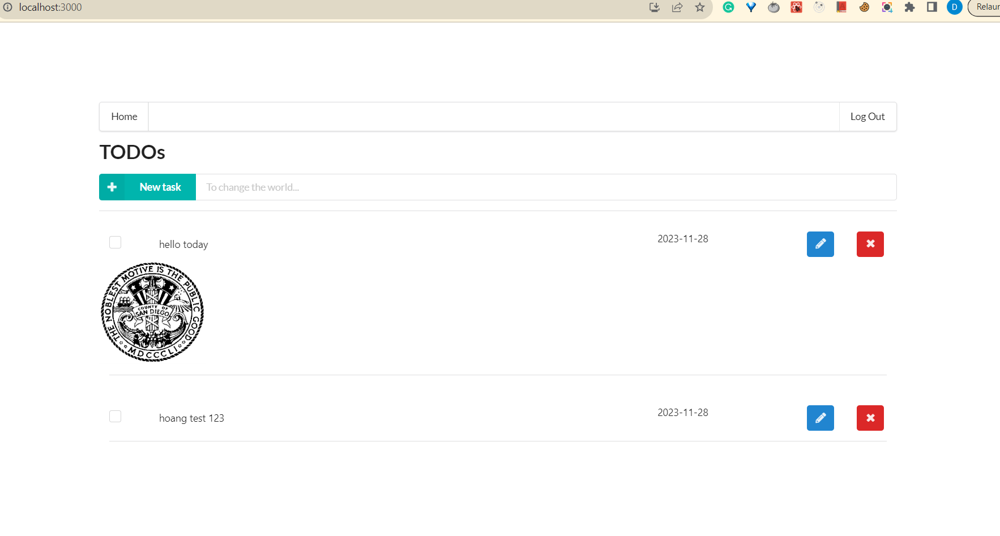

# Udacity Project 4: Serverless TODO APP
Config Client Env in the **./client/.env** file as below:

```sh
REACT_APP_AUTH0_DOMAIN=dev-7aals6zxu4h0lrxf.us.auth0.com
REACT_APP_AUTH0_CLIENT_ID=pLp7QRemz8QMUtMKWxdMaFKZsapZkNNe
REACT_APP_API_ENDPOINT= https://yqin3njsbf.execute-api.us-east-1.amazonaws.com/dev
```

## I. Client
**Home Page**
 